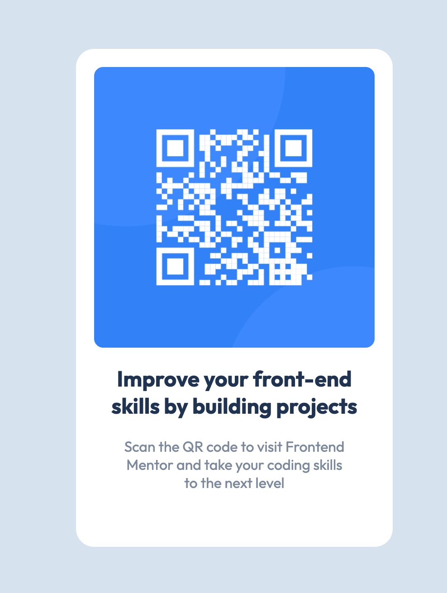

# Frontend Mentor - QR code component solution

This is a solution to the [QR code component challenge on Frontend Mentor](https://www.frontendmentor.io/challenges/qr-code-component-iux_sIO_H). Frontend Mentor challenges help you improve your coding skills by building realistic projects. 

## Table of contents

- [Overview](#overview)
  - [Screenshot](#screenshot)
  - [Links](#links)
- [My process](#my-process)
  - [Built with](#built-with)
  - [What I learned](#what-i-learned)
  - [Continued development](#continued-development)
  - [Useful resources](#useful-resources)
- [Author](#author)

## Overview

### Screenshot

### Links

- Solution URL: [Add solution URL here](https://github.com/lsensat/qr-component.git)
- Live Site URL: [Add live site URL here](https://lsensat.github.io/qr-component/)

## My process

I've started by building a pre-design/draft on Figma, to see how will more or less be. During the development on HTML/CSS I had to tune a bit the propotions of the card as well as the size of the fonts.

I had some trouble on centering the QR as well as the card and the text ".attribution" that is written below. I searched on the web, view a few videos and did it using flex attribute on CSS.

### Built with

- Pre-design on Figma
- Semantic HTML5 markup
- CSS custom properties
- Flexbox
- Mobile-first workflow

### What I learned

I didn't now how to center an item and keep it responsive while changing the layout. Firstly, I practiced a bit with Figma, which I am new on it, helping me to sharpen the basics and see in minutes a good draft of the challenge.
I then just continued to develop the HTML with all the <sections> and <h> I could thing I had to manage and then I proceeded with CSS. With it, I dealed with the padding, position and display to finish up using "display: flex;".

### Continued development

I would love to deep dive a bit more on how CSS flex, seemed a very nice feature and a very fine attribute to have in mind when designing responsive websites.

### Useful resources

- [Youtube](https://www.youtube.com) - Helped me to understand a bit more how CSS flex works.
- [Stack Overflow](https://stackoverflow.com/) - Helped me to understand some issues I had with git, as well as some check some post on centering items with CSS.

**Note: Delete this note and replace the list above with resources that helped you during the challenge. These could come in handy for anyone viewing your solution or for yourself when you look back on this project in the future.**

## Author

- Frontend Mentor - [@lsensat](https://www.frontendmentor.io/profile/lsensat)
- Twitter - [@lsensat](https://www.twitter.com/lsensat)
